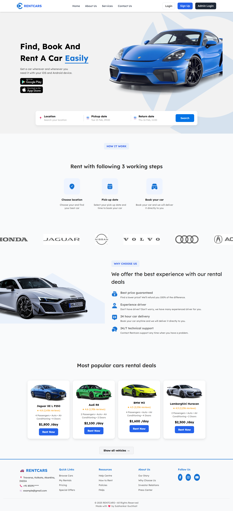

# Car-Rental-Management-System
Car Rental Management System – A complete web-based solution for managing car rentals. Built with PHP, MySQL, HTML, CSS, JavaScript, Bootstrap 5, and Tailwind CSS, it allows secure user registration, car management, real-time bookings, responsive design, and an admin dashboard for efficient fleet and customer management.

