# 🚗 Car Rental Management System  

Car Rental Management System is a complete **web-based solution** for managing car rentals.  
It provides features for **secure user registration, car management, real-time bookings, responsive design**, and an **admin dashboard** for efficient fleet and customer management.  

---

## 🛠️ Tech Stack
- **Frontend:** HTML, CSS, JavaScript, Bootstrap 5, Tailwind CSS  
- **Backend:** PHP  
- **Database:** MySQL  

---

## ✨ Features
✔️ User authentication (Login / Signup)  
✔️ Browse available cars & make bookings  
✔️ User dashboard with rental history  
✔️ Admin panel for managing cars, users, and reports  
✔️ Responsive design (mobile-friendly)  

---

## 📸 Screenshots  

### 🏠 Home Page  
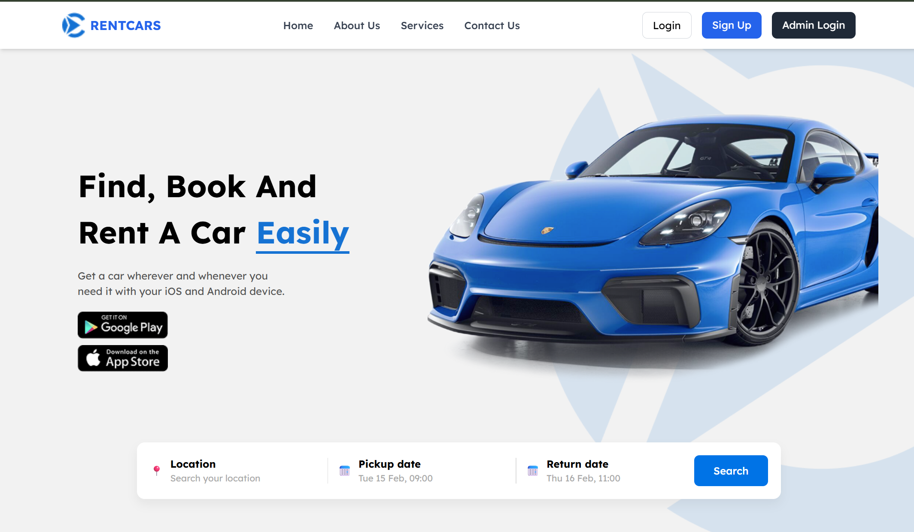  

### ℹ️ About / Services / Contact  
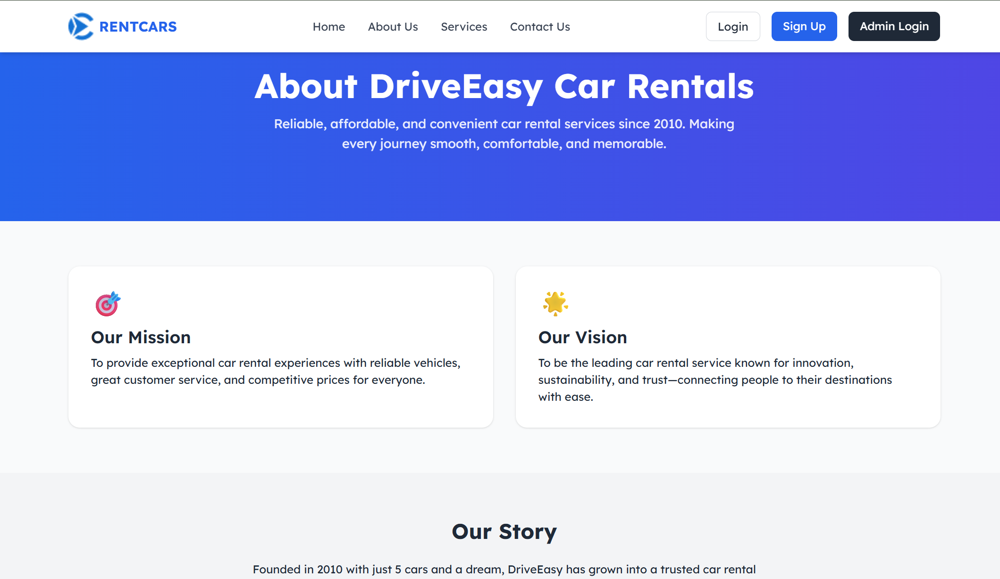  
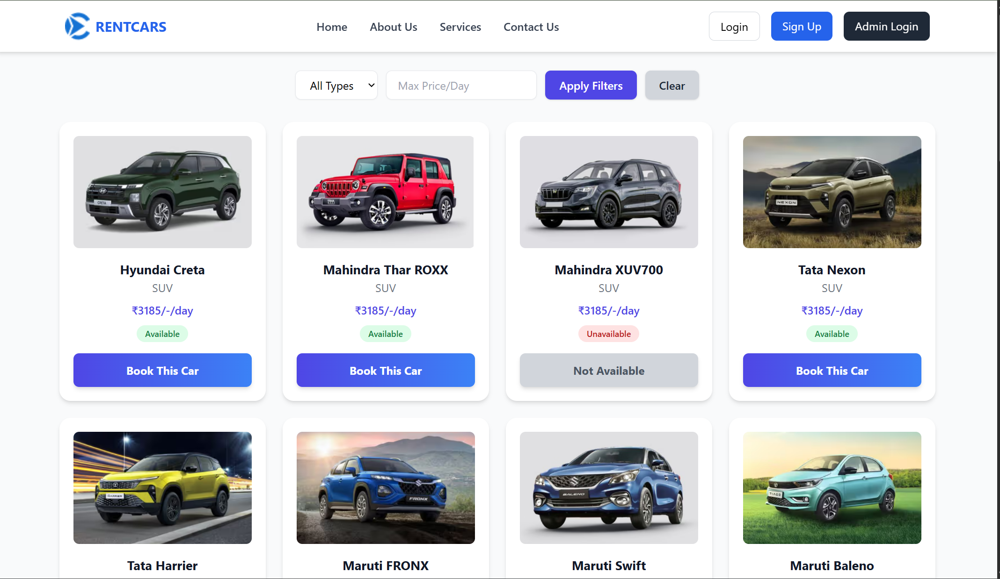  
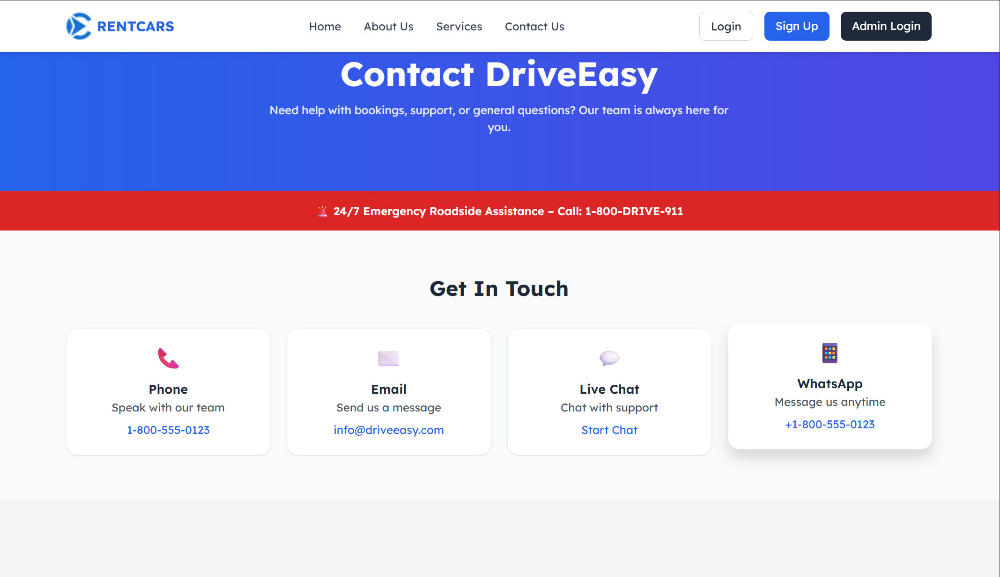  

### 🔐 Authentication  
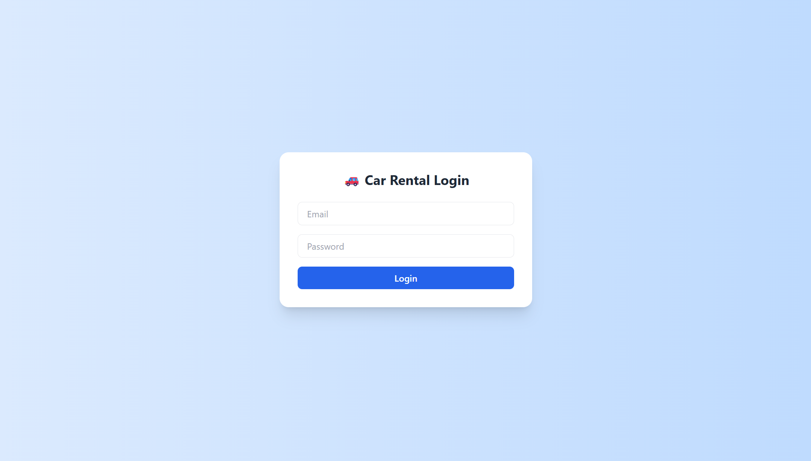  
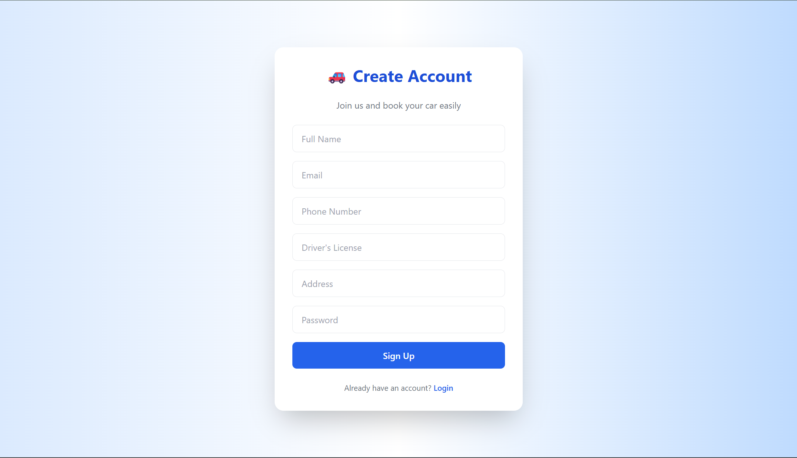  

### 👤 User Dashboard  
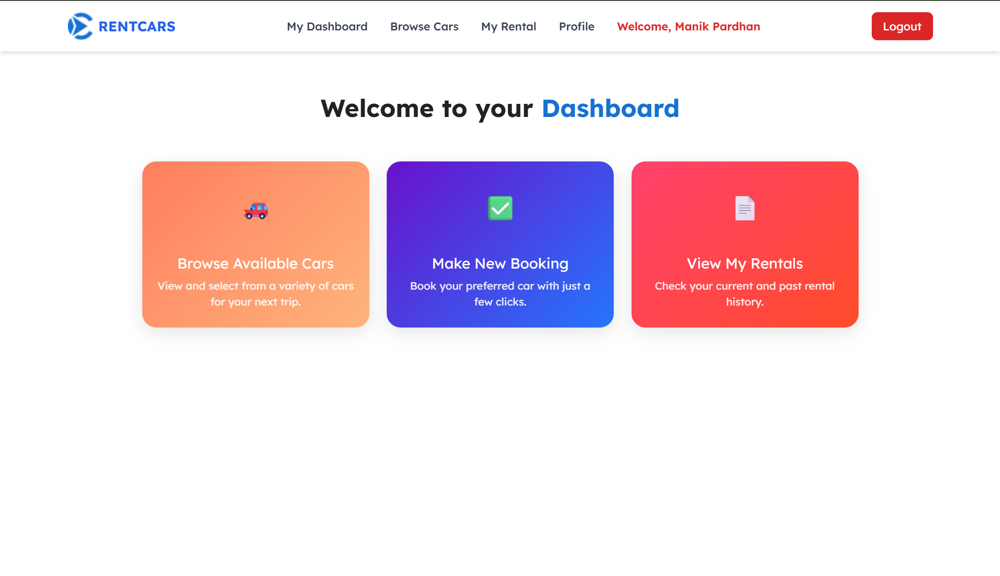  
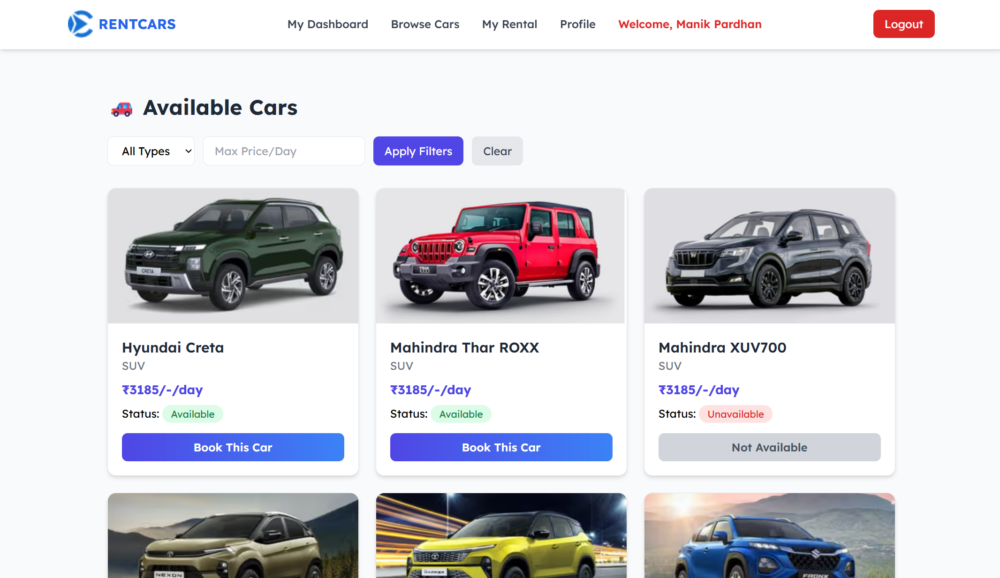  
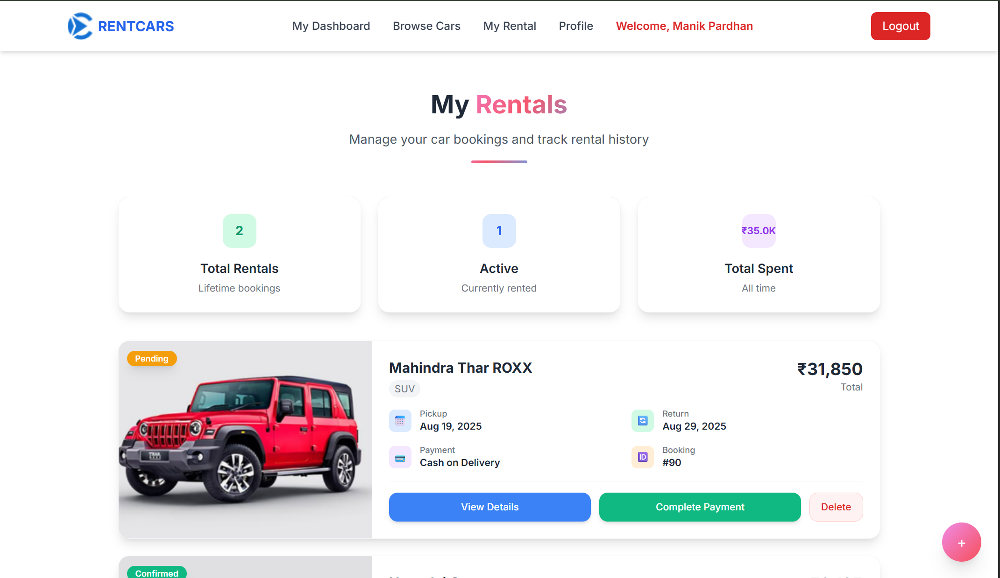  
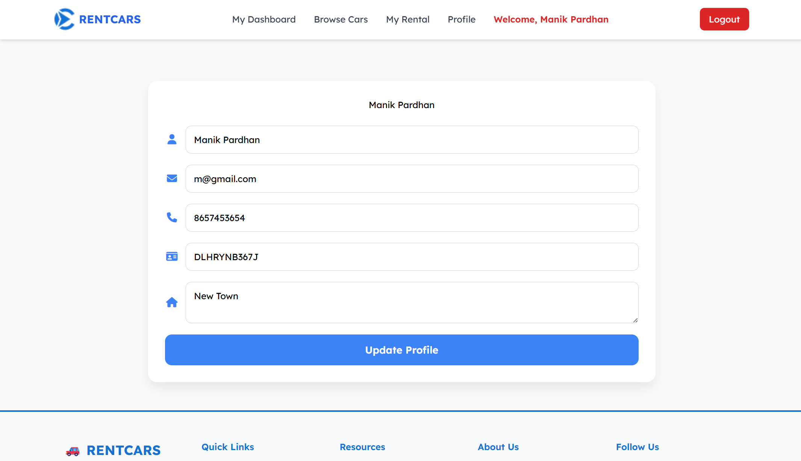  

### 🛠️ Admin Panel  
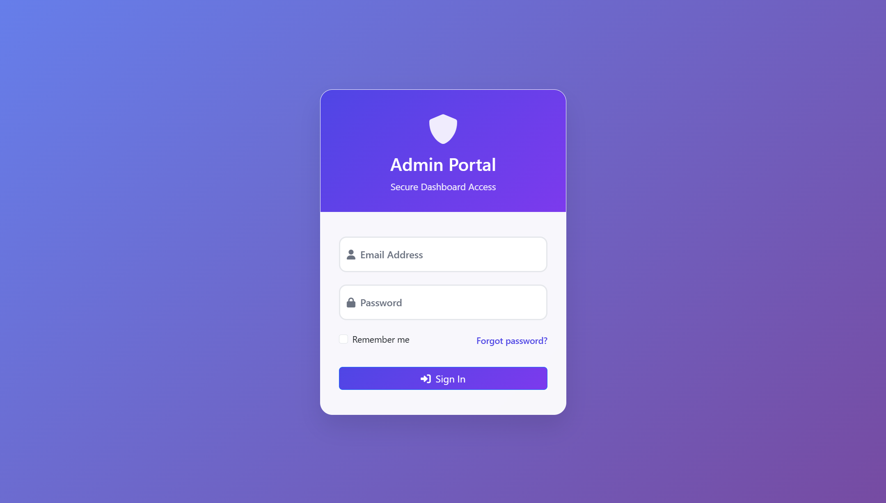  
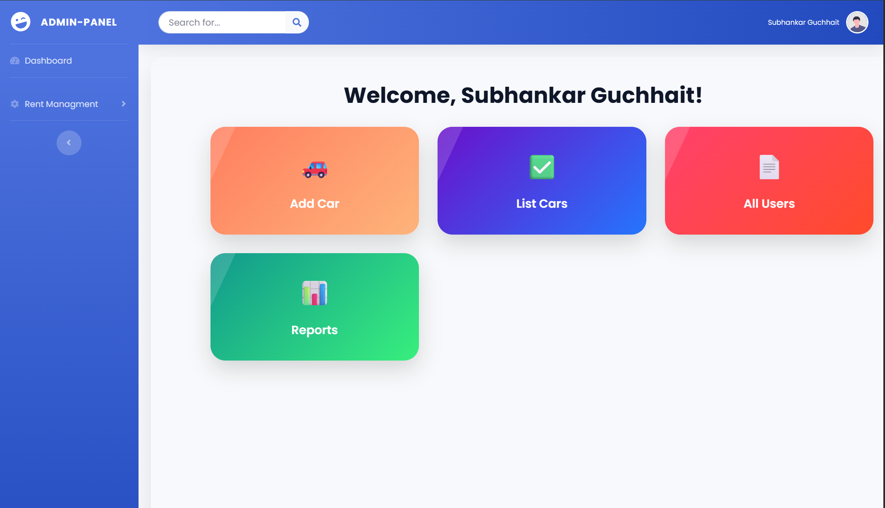  
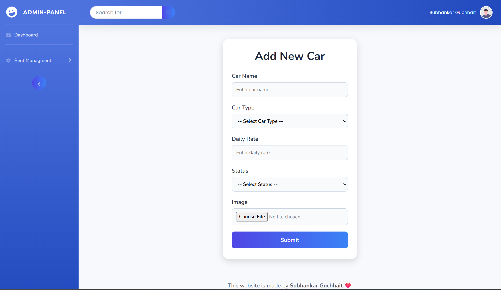  
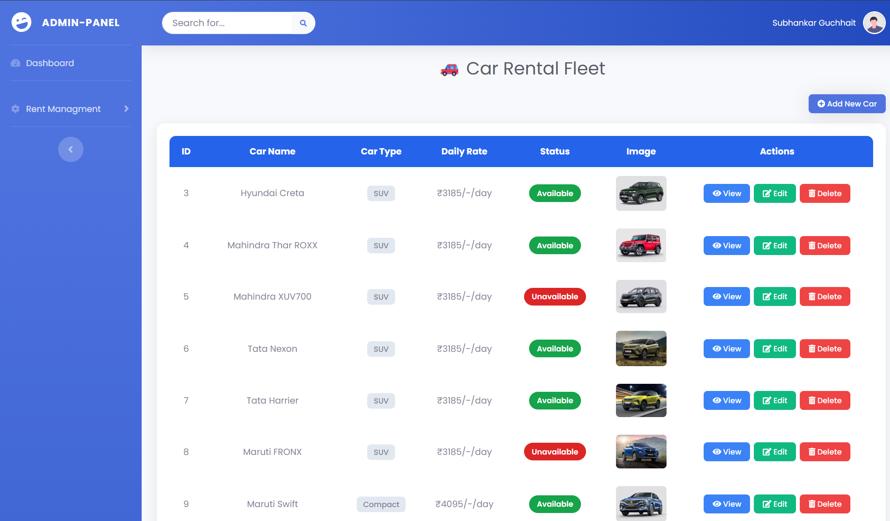  
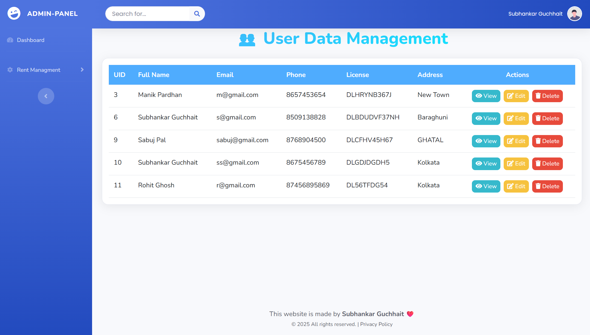  
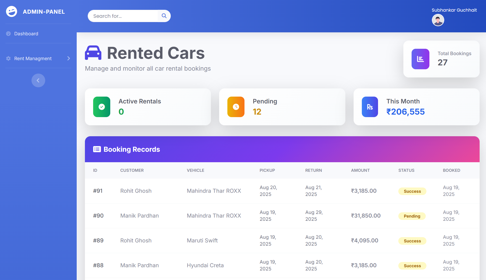  
